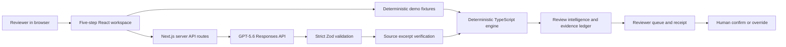

# PolicyProof

PolicyProof is an OpenAI Build Week 2026 project for the Work & Productivity track. It turns a written business policy into reviewable controls, evaluates controlled fictional document-based cases, and keeps every result connected to supporting, contradictory, or missing evidence.

## Problem and solution

Finance, procurement, and internal-control reviewers often compare policy text with scattered business documents. Conclusions can become difficult to reproduce because the underlying evidence is separated from the review result.

PolicyProof provides one focused, bilingual workspace to review controls, run a case, inspect exact excerpts, record human judgment, and produce a local decision receipt. It is a review aid, not an autonomous approval tool or a compliance certification.

## Current status

The deterministic demo is the guaranteed, fully tested path. It uses version-controlled fictional fixtures and makes no AI request. A strict scenario contract now drives three profiles through the same procurement policy, seven controls, deterministic engine, evidence surfaces, and human-decision workflow: Northstar mixed-risk, Meridian compliant, and Atlas evidence-deficient. Results are calculated at runtime from scenario documents; expected fixture outcomes are test assertions and are never rendered as precomputed results.

The approved **Proofroom — The Evidence Ledger** interface combines a compact utility header, a horizontal five-step workflow ledger, a bilingual Case Library, policy and case-file folios, dense control and result registers, a split evidence inspector, review-intelligence panels, a prioritized human-decision queue, and a formal decision receipt. Optional Judge Mode guides real actions without performing them. Current-session case comparison, architecture, evidence-trust, and audit surfaces remain secondary and expose no score or ranking.

The default **Focused Demo** presents the same production state through a Northstar-first judge path: one Run review action, compact outcomes, the exact EUR/USD contradiction, deterministic rerun, Review Fingerprint, and human decision. **Open full workspace** exposes every advanced surface without resetting review state. Judge Mode is now a compact four-stage manual guide.

Each deterministic run produces a versioned Review Fingerprint: a lowercase SHA-256 digest of canonical policy, controls, parameters, source documents, structured facts, exact evidence, and deterministic conclusions. A same-input rerun reproduces 7/7 Northstar conclusions and the same digest without replacing human state. A EUR 10,000 → EUR 15,000 change makes only `CTRL-01` pass, leaves six controls unchanged, and changes the digest. The fingerprint is not a signature, identity proof, authorship proof, or trusted timestamp.

The Live GPT-5.6 path is implemented behind a server-only API boundary. It can compile policy text into proposed controls and extract structured facts from selected text documents. One controlled live validation with the fictional Northstar case passed on 2026-07-14: GPT-5.6 returned seven human-reviewed controls and 14 source-verified evidence items, and the deterministic engine produced the expected 3 PASS, 2 FAIL, 1 MISSING, and 1 WARNING. See `docs/evaluation/LIVE_GPT56_VALIDATION.md`. This single case does not establish general model accuracy.

The live-validation evidence is preserved by commit `eb120feaca78bf3cdbc71b7b7198045f86a44852` (`test: validate live GPT-5.6 evidence pipeline`). Commit `76c6ce62a0fdbefa721e40d6f321fcea4b9e8db4` is the preceding judge-experience redesign, not the validation commit. Release ancestry can be checked with `git merge-base --is-ancestor eb120feaca78bf3cdbc71b7b7198045f86a44852 HEAD`.

## Screenshots

Local Playwright runs generate ignored English and French screenshots at desktop and mobile widths. The Proofroom integration and review-intelligence workspace were inspected through repeated desktop, tablet, mobile, component, decision, receipt, threshold-change, run-comparison, print, loading, and safely mocked provider-error captures. The builder will select production captures for the public repository after deployment so the README does not publish development-only images or local paths.

Mocked provider-error captures remain local-only and are not public product screenshots.

## Product workflow

1. Select one of three controlled fictional cases and review the shared policy.
2. Review, edit, enable, or disable controls.
3. Load the bundled demo case or select fictional local text documents.
4. Run the deterministic review; use outcome composition, evidence coverage, chronology, threshold sensitivity, local search, and filters to direct attention.
5. Inspect exact evidence, work through the prioritized reviewer queue, record a human decision, and print or export the decision receipt as JSON, Markdown, or a UTF-8 CSV evidence matrix.

The optional guided demo tracks these real actions without performing them automatically. It leads from loading Northstar through the EUR/USD contradiction and receipt to a EUR 15,000 rerun. The previous run is stored as one minimal, versioned local snapshot when browser storage is available; blocked storage never prevents the current review. Desktop uses a ruled horizontal workflow ledger with persistent case context; tablet and mobile preserve it as a compact horizontally scrollable step strip.

## Review intelligence

PolicyProof derives its review intelligence from the same structured controls, results, evidence, and documents used by the deterministic engine. It does not create a composite risk score or a second source of truth.

- **Case Overview** summarizes the current case, method, document set, and unresolved attention.
- **Outcome Composition** filters the result register through a semantic stacked bar.
- **Evidence Coverage Map** distinguishes supporting, contradictory, missing, and not-applicable evidence and opens the selected control.
- **Chronology** orders actual case dates from the fictional documents.
- **Threshold Sensitivity** explains the purchase amount against the current approval threshold.
- **Run Comparison** shows the current run beside one previous local snapshot and identifies changed controls.
- **Evidence Integrity** replaces an unsupported confidence percentage with exact-source, explicit-missing, or needs-review states.
- **Reviewer Queue** prioritizes unresolved failures, missing items, warnings, and remaining passes without changing their original results.

See `docs/FEATURE_GUIDE.md`, `docs/USER_GUIDE.md`, and `docs/ARCHITECTURE.md` for the complete product and technical guide.

## Proofroom design direction

The production interface translates the approved package in `docs/design/proofroom-ui/` into the validated React architecture. The design package controls visual hierarchy, tokens, evidence-led composition, responsive transformations, motion, and receipt treatment. Existing PolicyProof schemas, exact-excerpt validation, deterministic calculations, GPT-5.6 routes, security boundaries, and human-decision rules remain authoritative.

Codex implemented this direction in the application; the static HTML boards were references, not generated production code. No design-system dependency, remote font, state library, database, or new runtime package was added.

## Technical stack

- Next.js 16.2.10 and React 19.2.7
- TypeScript 6.0.3 in strict mode
- Tailwind CSS 4.3.2
- Zod 4.4.3
- OpenAI JavaScript SDK 6.46.0
- Vitest 4.1.10 and Testing Library
- Playwright 1.61.1 with Chromium
- pnpm 11.7.0 with a committed lockfile and restricted dependency build scripts

There is no database, authentication, payment system, ERP integration, OCR service, or multi-agent application architecture.

## Prerequisites

- Node.js 24 or newer
- pnpm 11.7.0
- Git

Docker, Python, and GitHub CLI are not required to run the application.

## Local setup

From a terminal opened in the cloned repository:

```shell
pnpm install
pnpm dev
```

Open [http://localhost:3000](http://localhost:3000). Stop the server with `Ctrl+C`.

Project commands disable Next.js telemetry. `pnpm-workspace.yaml` allows dependency build scripts only for `sharp` and `unrs-resolver`.

## Deterministic demo instructions

1. Open PolicyProof and confirm the default **Focused Demo** shows Northstar, seven enabled controls, five fictional records, and no precomputed outcome counts.
2. Leave the approval threshold at `10000` and select **Run review** in the focused panel.
3. Confirm the expected outcomes:
   - Purchase order timing: PASS
   - Amount match: PASS
   - Currency consistency: FAIL
   - Approval threshold: FAIL
   - Delivery evidence: PASS
   - Independent bank verification: MISSING
   - Segregation of duties: WARNING
4. Inspect **Currency consistency** and confirm the exact `12,480 EUR` purchase-order excerpt and `12,480 USD` invoice excerpt plus their source IDs and locators.
5. Select **Rerun deterministic checks**. Confirm **7 of 7 conclusions reproduced identically** and **Review fingerprint unchanged**. This action makes no OpenAI request and preserves human decisions.
6. Change the focused approval threshold to `15000` and rerun. Confirm `CTRL-01: FAIL → PASS`, six unchanged controls, and a changed fingerprint. Parameter-changing reruns intentionally reset prior reviewer decisions.
7. Record a human decision, then open the full decision to inspect or export the receipt.
8. Select **Open full workspace** to inspect the five-step workflow, Case Library, analytics, search, audit trail, scenario comparison, print, JSON, Markdown, and CSV exports. Select **Return to focused demo** to confirm state remains intact.

Use the **English / Français** selector at any point. Navigation, actions, statuses, validation, and the displayed receipt change language immediately. Source documents, exact evidence excerpts, stable control identifiers, and internal enum values remain unchanged.

## Live GPT-5.6 setup

Live mode is disabled when no server-side API key is configured. The deterministic demo remains available.

1. Copy `.env.example` to `.env.local`.
2. Edit `.env.local` locally and set `OPENAI_API_KEY` to your own key. Never paste the value into chat, documentation, screenshots, or source control.
3. Restart `pnpm dev`.
4. Confirm that **Live GPT-5.6** becomes available.
5. Use only fictional policy text and fictional `.txt`, `.md`, or `.json` documents.
6. Compile the policy, review and edit the proposed controls, explicitly approve them, then run the case analysis.

Supported local documents are limited to 10 files, 1 MB each. Files are read in the browser and are sent externally only when the user explicitly runs Live analysis. PDF and OCR are not supported.

### Environment variables

| Variable | Required | Scope | Purpose |
| --- | --- | --- | --- |
| `OPENAI_API_KEY` | Live mode only | Server only | Authenticates Responses API requests. |

The key is never returned by `/api/ai/status` and is never included in browser code.

## GPT-5.6 integration

The model configuration is isolated in `src/openai/config.ts` and uses the official `gpt-5.6` alias, Responses API, low reasoning effort, request timeout, and Structured Outputs validated with Zod. This follows the official [latest model guide](https://developers.openai.com/api/docs/guides/latest-model) and [Structured Outputs guide](https://developers.openai.com/api/docs/guides/structured-outputs).

GPT-5.6 is responsible for policy interpretation and evidence extraction. TypeScript remains responsible for amount and currency comparison, date ordering, approval counting and thresholds, document presence, segregation-of-duties equality checks, result summaries, human decisions, and receipts.

The server validates that every quoted evidence excerpt exists in the supplied fictional source text. Provider errors are converted into safe user-facing messages. GPT-5.6 does not approve payments and does not issue a legal or compliance certification.

## Architecture overview



The browser never calls OpenAI directly. The deterministic judging path stops at local fixtures and the TypeScript engine; the live path crosses the server boundary only after an explicit user action.

- `app/` contains the Next.js page, styles, and server API routes.
- `components/workspace/` contains focused UI sections; `DemoReviewWorkspace` owns temporary page state.
- `src/domain/` contains Zod schemas and shared domain types.
- `src/fixtures/` contains the deterministic case plus mocked policy and document evaluation contracts.
- `src/i18n/` contains the typed English/French presentation dictionary and hydration-safe locale context.
- `src/lib/` contains deterministic review, review-intelligence, optional run-history, receipt, summary, and local-document logic.
- `src/openai/` contains server-only client configuration, prompts, mappers, validation, and safe route handlers.
- `tests/` contains unit, integration, component, and browser tests.

Live requests pass through server routes, validated structured outputs are mapped into domain objects, and deterministic code calculates supported controls. Missing, refused, incomplete, malformed, or source-inconsistent model output fails closed.

## Testing

Run the mandatory checks:

```powershell
pnpm test
pnpm typecheck
pnpm lint
pnpm build
```

Install the Playwright browser once, then run the critical journey:

```powershell
pnpm exec playwright install chromium
pnpm test:e2e
```

In the isolated Codex runtime, keep the browser inside the project:

```powershell
$env:PLAYWRIGHT_BROWSERS_PATH = "0"
& $pnpm exec playwright install chromium
& $pnpm test:e2e
```

Run the production dependency audit with:

```powershell
pnpm audit --prod
```

The latest recorded results are in `TESTING.md`.

The secret-free GitHub Actions workflow in `.github/workflows/ci.yml` runs frozen installation, unit/component tests, type checking, linting, and the production build. Playwright remains a required local release gate until public-runner reliability is supervised.

## Deployment preparation

See `docs/DEPLOYMENT.md` for the supervised Vercel configuration, environment boundary, smoke tests, rollback guidance, and Live GPT-5.6 verification. No deployment is performed by the repository itself.

## Security and privacy

- Never commit `.env.local` or any credential; environment files are ignored except `.env.example`.
- Use fictional demonstration data only.
- The OpenAI client is server-only.
- Model output is schema-validated and evidence excerpts are checked against submitted text.
- Policy and document text are treated as untrusted source material, not as instructions.
- Local filenames, declared MIME types, count, size, empty content, binary content, duplicates, and JSON syntax are validated.
- Invalid UTF-8 replacement markers and single lines over 20,000 characters are rejected; HTML-like text remains escaped plain text.
- Responses use conservative MIME-sniffing, framing, referrer, camera, microphone, and geolocation headers.
- Deterministic demo mode does not make external requests.
- Selected local files remain in browser memory until an explicit Live analysis request.
- Dependency build scripts are restricted and the production dependency audit currently reports no known vulnerabilities.

## Is PolicyProof hard-coded for one demo?

No display result is hard-coded for Northstar. Three strict scenario fixtures provide different suppliers, amounts, dates, approvers, document contents, bank-change states, and result profiles. One shared engine produces Northstar 3/2/1/1, Meridian 7/0/0/0, and Atlas 4/1/2/0 from their structured facts. Switching cases clears volatile results and decisions, preserves language, and isolates run-history keys by scenario.

The scope is still intentionally narrow: one fictional procurement policy, three controlled case profiles, five text documents per case, and seven supported rule types. Northstar alone has a sanitized real GPT-5.6 validation; Meridian and Atlas are deterministic and mocked only. See `docs/evaluation/SCENARIO_VALIDATION_MATRIX.md`.

## Known limitations

- The prototype covers one procurement and vendor-change policy domain with three controlled fictional case profiles; it does not prove cross-industry generalization.
- Most browser review state, completed-case comparison, and the safe audit trail are temporary and lost on refresh. At most one minimal previous-run snapshot per scenario is kept locally when browser storage is available.
- Live GPT-5.6 passed one paid controlled evaluation with the fictional Northstar case; broader policies, documents, and repeated-run accuracy remain unvalidated.
- Semantic controls that cannot be computed deterministically are not converted into a final automated approval.
- Only `.txt`, `.md`, and `.json` local files are supported; there is no PDF or OCR workflow.
- There is no durable persistence, authentication, collaboration, or external business-system integration.
- Automated keyboard, accessible-name, responsive overflow, and document-language checks pass; a final assistive-technology review remains before submission.
- A strict Content Security Policy is deferred until it can be verified against the deployed Next.js runtime.
- The Review Fingerprint detects changes in canonical review content; it does not prove source authenticity, identity, authorship, legal signature, or trusted time. Receipt-integrity verification is a separate planned phase.

## How Codex contributed

This primary Codex task contains the core build history. Codex inspected the baseline, implemented the deterministic and GPT-5.6 architecture, refactored the interface, added tests, ran quality and security checks, and maintained the English product documentation. The builder remains responsible for product decisions, controlled live-model validation, deployment, demonstration recording, and final submission approval.

## Accounts and credentials needed later

- OpenAI API account with billing or hackathon credits and GPT-5.6 access
- One OpenAI API key stored only in local and deployment environment settings
- GitHub account and submission repository
- Vercel account linked to the repository
- YouTube account for the public video under three minutes

## Hackathon submission checklist

- [ ] Builder validates the deterministic demo manually
- [x] Controlled GPT-5.6 evaluation passes with fictional data
- [ ] Repository is committed and published
- [ ] Application is deployed and smoke-tested
- [ ] English README includes final screenshots and deployment URL
- [ ] Public YouTube demonstration is under three minutes
- [ ] Primary Codex `/feedback` Session ID is recorded

## License

No license has been selected yet. `docs/submission/LICENSE_RECOMMENDATION.md` compares MIT and Apache-2.0 without making the decision for the builder.
