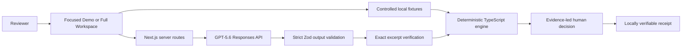

# PolicyProof

**Every result traced. Every decision defensible.**

PolicyProof is a verification layer for procurement review. It turns written policy into reviewable controls, links each conclusion to exact evidence, runs objective checks deterministically, and keeps the final decision human.

> GPT-5.6 reads and locates.
>
> TypeScript checks.
>
> A human decides.

PolicyProof is a solo OpenAI Build Week 2026 project for the **Work & Productivity** track. It is designed for finance, procurement, and internal-control reviewers who need conclusions they can inspect and reproduce.

## Quick verification

```shell
pnpm install --frozen-lockfile
pnpm demo:verify
pnpm dev
```

Open [http://localhost:3000](http://localhost:3000). `pnpm demo:verify` needs no API key, browser, development server, or live provider. It validates the three controlled scenarios, 21 conclusions, seven mutations, ten named adversarial cases, Review Fingerprints, Receipt Integrity, TypeScript, and the evaluation no-network guard.

## Product overview

A reviewer can load a controlled policy and case, inspect seven controls, run a deterministic review, follow supporting or contradictory excerpts, record a final human decision, and export a locally verifiable receipt. The default Focused Demo makes the evidence path easy to present; Full Workspace retains the complete review, audit, comparison, and export surfaces.

PolicyProof is a review aid. It does not approve a payment, certify compliance, establish document authenticity, or replace professional judgment.

## Primary controlled example

Northstar is a fictional vendor-change and procurement case. The shared engine produces:

| Outcome | Count |
| --- | ---: |
| PASS | 3 |
| FAIL | 2 |
| MISSING | 1 |
| WARNING | 1 |

The clearest evidence moment is a purchase order for **12,480 EUR** and an invoice for **12,480 USD**. PolicyProof shows both exact excerpts and fails currency consistency while amount match still passes. With one approver, changing the policy threshold from EUR 10,000 to EUR 15,000 changes only the approval control from FAIL to PASS; the other six conclusions remain unchanged.

## Why this is not a document chatbot

The model does not make the final control result. GPT-5.6 proposes structured controls and locates structured facts and exact excerpts. Strict schemas and source checks reject unsupported references. The TypeScript engine then performs supported amount, currency, date, threshold, evidence-presence, and role comparisons. A reviewer confirms or overrides the final review with comments.

## Architecture



The deterministic path stops at local fictional fixtures and the TypeScript engine. The optional live path crosses the server boundary only after an explicit user action. The OpenAI key remains server-only.

## GPT-5.6 responsibilities

- Interpret the written procurement policy.
- Propose structured, editable controls.
- Extract structured facts from explicitly selected fictional text documents.
- Locate exact evidence excerpts.
- Support the historically validated Northstar evidence pipeline.

Northstar has one separate historical live GPT-5.6 validation at commit `eb120feaca78bf3cdbc71b7b7198045f86a44852`. The release checks do not rerun it. See [Live GPT-5.6 validation](docs/evaluation/LIVE_GPT56_VALIDATION.md).

## TypeScript responsibilities

- Validate scenario, provider-output, evidence, fingerprint, receipt, and evaluation schemas.
- Reject unknown documents and unsupported exact excerpts.
- Calculate the seven supported deterministic control types.
- Reproduce same-input conclusions and Review Fingerprints.
- Isolate threshold mutations and scenario state.
- Generate and verify receipt integrity locally.

## Human responsibilities

- Confirm or edit model-proposed controls.
- Interpret business context and exceptions.
- Review supporting, contradictory, and missing evidence.
- Record the final decision and comments.
- Decide whether a case is ready for operational action.

Neither GPT-5.6 nor the deterministic engine issues a legal or compliance certification.

## Focused Demo

Focused Demo is the default Northstar-first presentation. Its path is:

1. Run review.
2. Inspect the EUR/USD contradiction.
3. Reproduce all seven conclusions with the same Review Fingerprint.
4. Change the threshold and inspect the one-control difference.
5. Record a human decision.
6. Generate and verify the decision receipt.

It uses the same application state and engine as Full Workspace; it is not a scripted or precomputed second application.

## Full Workspace

Full Workspace adds the Case Library, policy and document registers, editable controls, full result and evidence views, search and filters, current-session comparison, safe audit details, reviewer queue, print, JSON, Markdown, and CSV exports. Switching presentation level preserves active review state.

## Three controlled scenarios

All scenarios use the same procurement policy, seven control types, typed scenario contract, and deterministic engine.

| Scenario | Profile | PASS | FAIL | MISSING | WARNING | Validation boundary |
| --- | --- | ---: | ---: | ---: | ---: | --- |
| Northstar | Mixed risk | 3 | 2 | 1 | 1 | Deterministic now; historical live GPT-5.6 evidence |
| Meridian | Complete, below threshold | 7 | 0 | 0 | 0 | Deterministic and mocked |
| Atlas | Evidence deficient | 4 | 1 | 2 | 0 | Deterministic and mocked |

Expected fixture outcomes are test assertions. Displayed results are calculated at runtime. See the [scenario validation matrix](docs/evaluation/SCENARIO_VALIDATION_MATRIX.md).

## Review Fingerprint

`policyproof.review-fingerprint.v1` is a lowercase SHA-256 digest of canonical semantic review content: policy, enabled controls and parameters, controlled documents and facts, exact evidence references, and deterministic conclusions. Same semantic inputs reproduce the same fingerprint. Human decisions, comments, language, audit events, receipt identifiers, and timestamps are excluded.

The Review Fingerprint is not a digital signature, identity proof, authorship proof, or trusted timestamp. See the [Review Fingerprint model](docs/REVIEW_FINGERPRINT_MODEL.md).

## Receipt Integrity

`policyproof.receipt-integrity.v1` protects one exact `policyproof.decision-receipt.v1` instance, including the Review Fingerprint, human decisions, comments, safe audit events, receipt identifier, language, and generation time. Current or exported JSON receipts can be checked entirely in the browser.

The integrity check confirms that the receipt content matches its recorded hash. Because the hash is not digitally signed, it does not establish origin, identity, authorship, authenticity or trusted time. Someone who can replace both the content and hash can create a new internally consistent pair. See the [Verifiable Receipt model](docs/VERIFIABLE_RECEIPT_MODEL.md).

## Competition Evaluation Harness

`pnpm eval:competition` exercises the production scenario schemas and shared engine without a browser or provider. Its deterministic report covers:

- 3 of 3 scenarios;
- 21 of 21 controlled conclusions;
- 34 controlled evidence references;
- exact excerpt and evidence-to-control validation;
- scenario isolation and deterministic reproduction;
- threshold sensitivity and Review Fingerprints;
- Receipt Integrity and modification detection;
- 7 of 7 isolated business-rule mutations;
- 10 of 10 named adversarial boundaries;
- zero attempted external calls under its scoped network guard.

The harness distinguishes executed deterministic checks, mocked checks, and historical live evidence. It does not prove universal policy coverage or universal adversarial safety. Read the [methodology](docs/EVALUATION_HARNESS.md) and [deterministic report](docs/evaluation/COMPETITION_EVALUATION_REPORT.md).

## Local installation

Prerequisites:

- Node.js 24 (validated locally with 24.14.0)
- pnpm 11.9.0
- Git

```shell
pnpm install --frozen-lockfile
pnpm demo:verify
pnpm dev
```

The repository remains private as an npm package (`"private": true`) and is not published to npm. Stop the local server with `Ctrl+C`.

## Optional live GPT-5.6 setup

Live mode is optional. The deterministic demo remains the default and works with no environment file.

1. Copy `.env.example` to `.env.local`.
2. Set `OPENAI_API_KEY` locally to your own key.
3. Never paste the value into chat, issues, documentation, screenshots, or source control.
4. Restart `pnpm dev` and explicitly select a live feature.
5. Use fictional `.txt`, `.md`, or `.json` documents only.

The key is read only on the server. It is never returned by `/api/ai/status` or placed in client code. Missing provider access fails safely while deterministic mode remains available.

## Tests and validation

The current release contains **201 Vitest tests** and **23 Playwright tests**. The principal commands are:

```shell
pnpm demo:verify
pnpm eval:competition
pnpm test
pnpm typecheck
pnpm lint
pnpm build
pnpm test:e2e
pnpm release:verify
pnpm audit --prod
```

`pnpm release:verify` runs release hygiene, Markdown link checks, deterministic verification and TypeScript, the full Vitest suite, lint, production build, Playwright, and Git diff/cleanliness checks. It does not include `pnpm audit --prod` because the registry-dependent audit is a separate online gate. Chromium must be installed before the full release command: `pnpm exec playwright install chromium`.

GitHub Actions repeats frozen installation, deterministic verification, full tests, build, Chromium paths, and the production audit without an OpenAI secret or deployment step. See [Testing](TESTING.md) and [clean-room verification](docs/release/CLEAN_ROOM_VERIFICATION.md).

## Codex collaboration

The owner selected the problem, domain, audience, controlled cases, human-in-the-loop boundary, scope reductions, and accepted each development phase. Codex accelerated architecture, implementation, testing, diagnosis, documentation, and release preparation under that direction. GPT-5.6 is a product runtime component; Codex is the development collaborator. See [Codex and GPT-5.6 usage](docs/CODEX_AND_GPT56_USAGE.md).

The official `/feedback` Session ID is an owner-supplied submission field and is intentionally not stored or invented here.

## Security boundaries

- Bundled data is fictional.
- Policy and document text is untrusted data, not application instruction.
- Structured outputs, document references, exact excerpts, and receipt imports fail closed.
- Deterministic Demo and repository verification need no provider and make no live model request.
- The evaluation guard recorded zero attempted external calls for the verified workflow; this is scoped evidence, not a claim about every possible platform primitive.
- The named prompt-injection test proves only that hostile text remains inert in the tested local structured boundary.
- The receipt hash detects included-content changes only while the recorded hash is retained; it is unkeyed and unsigned.
- Browser review and audit state is temporary, not durable secure storage.

Read [SECURITY.md](SECURITY.md), [Security and Limitations](docs/SECURITY_AND_LIMITATIONS.md), and the [adversarial matrix](docs/ADVERSARIAL_TEST_MATRIX.md).

## Known limitations

- One controlled procurement and vendor-change policy domain is supported.
- The three scenarios are fictional and deliberately bounded; only Northstar has historical live GPT-5.6 evidence.
- Local inputs are text-based; PDF parsing, OCR, source authentication, and ERP integration are out of scope.
- Model extraction can fail or omit facts. Exact citation checks reduce unsupported evidence references but do not establish document truth.
- Receipt integrity is not legal signature, identity, origin, authenticity, or trusted-time proof.
- Browser state is mostly session-local; there is no authentication, database, durable audit store, or collaboration layer.
- Automated checks do not replace production, accessibility, security, legal, or user validation.

## Repository structure

```text
app/                    Next.js page and server API routes
components/workspace/   Focused Demo and Full Workspace UI
src/domain/             Strict schemas and shared types
src/fixtures/           Controlled fictional scenarios and evaluation data
src/lib/                Deterministic engine, fingerprints, receipts, exports
src/openai/             Server-only GPT-5.6 integration
tests/                  Unit, component, integration, evaluation, and E2E tests
scripts/                Provider-free verification and release tooling
docs/evaluation/        Deterministic and historical validation evidence
docs/release/           Freeze, clean-room, deployment, and release guidance
docs/submission/        Devpost, video, demo, and owner checklists
```

Start with this README, then read the [product narrative](docs/PRODUCT_NARRATIVE.md), [architecture](docs/ARCHITECTURE.md), [evaluation harness](docs/EVALUATION_HARNESS.md), and [release manifest](docs/release/RELEASE_MANIFEST.md).

## License

PolicyProof is available under the [MIT License](LICENSE). Copyright (c) 2026 Ilies Sampaio Fernandes.
