# PolicyProof Architecture

## Overview

PolicyProof is one Next.js App Router application. React renders the browser workspace, Next.js server routes isolate OpenAI access, Zod validates runtime boundaries, and pure TypeScript performs supported review calculations. There is no database or state-management framework.

```mermaid
flowchart LR
    P["Policy text"] --> G["GPT-5.6 control proposal"]
    G --> H["Human control approval"]
    H --> D["Fictional case documents"]
    D --> E["GPT-5.6 structured extraction"]
    E --> V["Zod and exact-excerpt validation"]
    V --> T["Deterministic TypeScript review"]
    T --> R["Review intelligence workspace"]
    R --> J["Human decision"]
    J --> X["Print / JSON / Markdown receipt"]
```

The deterministic demo skips both GPT-5.6 operations and reads repository-controlled fixtures directly.

## Main directories

- `app/`: page, layout, global styles, and server API routes.
- `components/workspace/`: task panels, visualizations, reviewer queue, decision, and receipt presentation.
- `src/domain/`: Zod schemas and shared domain types.
- `src/fixtures/`: fictional Northstar data and evaluation contracts.
- `src/i18n/`: typed English/French presentation dictionary and locale context.
- `src/lib/`: deterministic engine, review intelligence, history, decisions, receipts, and local-document logic.
- `src/openai/`: server-only client, prompts, parsed-output handling, mapping, and safe diagnostics.
- `tests/`: unit, integration, component, contract, and Playwright tests.

## State ownership

`DemoReviewWorkspace` is the single browser state owner. It stores the active step, mode, presentation level, controls, documents, results, selected control, filter, reviewer comments and decisions, guide progress, fingerprint comparison, and current run metadata in React state. Focused Demo and Full Workspace receive the same handlers and domain state. The inactive Full Workspace remains mounted and hidden to preserve component-local search state; the inactive Focused presentation is unmounted to avoid duplicate accessible content.

## Run-history persistence

Only one minimal previous/latest run pair is stored under a versioned localStorage key. Zod validates loaded JSON. Corrupt or unavailable storage fails closed to an empty history. The stored shape excludes document content, evidence excerpts, reviewer comments, API data, and credentials.

## Review intelligence calculations

`src/lib/review-intelligence.ts` contains pure functions for:

- outcome composition;
- control/document evidence coverage;
- date chronology;
- approval threshold sensitivity;
- evidence integrity;
- reviewer queue priority;
- local search;
- current/previous run comparison.

React components receive these calculated values and do not reproduce business logic.

## OpenAI boundary

The browser calls PolicyProof server routes, never OpenAI directly. The official SDK uses the Responses API and Structured Outputs. Known failures are classified server-side, logged with sanitized diagnostics, and returned as a safe category and correlation/reference identifier. No provider request is made in deterministic mode or automated tests.

## Evidence validation

Structured output must pass Zod validation. Document identifiers must refer to submitted sources, and every quoted excerpt must occur verbatim in its source text. Invalid, missing, refused, incomplete, or malformed output fails closed.

## Rendering and accessibility

Visualizations use semantic HTML and CSS; no chart library is installed. Buttons provide keyboard access, glyphs and text supplement color, and grouped text remains available at mobile widths. Motion is short, purposeful, and removed through `prefers-reduced-motion`.

## Build and deployment shape

The root page is statically prerendered. `/api/ai/status`, `/api/ai/policy`, and `/api/ai/analyze` remain dynamic server routes. Vercel is the planned host, but deployment is a supervised manual step.

## Scenario boundary

`ReviewScenarioSchema` is the strict fixture boundary. It validates localized case context, the shared policy and controls, exact documents and facts, expected test assertions, evidence relationships, thresholds, guided highlights, assumptions, limitations, and fictional provenance. `loadScenario()` returns a defensive clone. `createScenarioResetState()` preserves locale while producing fresh policy, control, document, threshold, selection, and filter state.

The React workspace remains the single state owner. Switching scenarios clears results, evidence selection, filters, decisions, receipt, and current comparison. Minimal run-history keys include the scenario ID, preventing snapshots from crossing cases. Malformed fixtures fail closed before render.

## Competition surfaces

`CompetitionTools` receives actual current-session summaries, audit events, and scenario metadata from the workspace. It contains no review logic. Judge Mode stores only a step index. Scenario comparison stores no arbitrary score. The architecture diagram is semantic HTML/CSS. The audit contract is strict Zod data held in React state and capped at 100 events. CSV serialization is a pure TypeScript function over `ControlResult` data.

## Shared evaluation path

Northstar, Meridian, and Atlas all call `runDeterministicReview()` with the same seven control kinds. Fixture `expectedOutcomes` are used only by automated validation and never by the application rendering path. The optional GPT-5.6 routes and exact-excerpt validation are unchanged.

## Review Fingerprint boundary

`src/domain/review-fingerprint-schema.ts` defines the strict `policyproof.review-fingerprint.v1` payload. `src/lib/review-fingerprint.ts` builds it from current policy, enabled controls, active parameters, structured documents and facts, normalized deterministic results, exact evidence, and stable validation state. Semantic collections have explicit ordering; recursive object keys and line endings are canonicalized before deterministic UTF-8 JSON serialization.

The client-safe implementation calls Web Crypto SHA-256 and adds no dependency or Node-only bundle import. The dedicated rerun action calls `runDeterministicReview()` directly and never enters the OpenAI branch. Same-input success does not replace current results or human state. Changed inputs use established review replacement and decision reset. Same-input divergence retains both current and candidate results in React state and logs only a bounded safe audit event.

## Verifiable receipt boundary

`src/lib/receipt-integrity.ts` defines the strict receipt payload, cross-reference validation, documented collection ordering, deterministic serialization, native SHA-256, outer integrity block, and safe verification states. The receipt snapshot includes the Review Fingerprint plus normalized control/result/evidence references, human decisions and exact comments, bounded safe audit entries, identifier, language, and generation timestamp. `components/workspace/receipt-integrity-panel.tsx` performs current and imported JSON verification locally; it does not call an API or replace workspace state. The application state owner keeps the generated receipt stable across Focused Demo and Full Workspace and invalidates it when relevant review or decision state changes.

## Competition evaluation boundary

`src/evaluation/` is a test-and-release layer, not an application screen. It defines strict evaluation, mutation, and adversarial contracts; imports the existing scenario schemas, deterministic engine, Review Fingerprint, and Receipt Integrity functions; and executes them through the repository's Vitest runtime. It contains no second rule engine.

`pnpm eval:competition` scopes a guard over `fetch` and Node HTTP/HTTPS clients, evaluates all three controlled scenarios and 21 conclusions, runs seven cloned-input mutations and ten private adversarial cases, and writes stable Markdown and JSON reports. `pnpm demo:verify` adds focused test and TypeScript gates. Neither command needs a browser, server, environment file, API key, or provider. The historical Northstar GPT-5.6 result is referenced but never executed by the harness.
