# PolicyProof Architecture

## Overview

PolicyProof is one Next.js App Router application. React renders the browser workspace, Next.js server routes isolate OpenAI access, Zod validates runtime boundaries, and pure TypeScript performs supported review calculations. There is no database or state-management framework.

```mermaid
flowchart LR
    P["Policy text"] --> G["GPT-5.6 control proposal"]
    G --> H["Human control approval"]
    H --> D["Fictional case documents"]
    D --> E["GPT-5.6 structured extraction"]
    E --> V["Zod and exact-excerpt validation"]
    V --> T["Deterministic TypeScript review"]
    T --> R["Review intelligence workspace"]
    R --> J["Human decision"]
    J --> X["Print / JSON / Markdown receipt"]
```

The deterministic demo skips both GPT-5.6 operations and reads repository-controlled fixtures directly.

## Main directories

- `app/`: page, layout, global styles, and server API routes.
- `components/workspace/`: task panels, visualizations, reviewer queue, decision, and receipt presentation.
- `src/domain/`: Zod schemas and shared domain types.
- `src/fixtures/`: fictional Northstar data and evaluation contracts.
- `src/i18n/`: typed English/French presentation dictionary and locale context.
- `src/lib/`: deterministic engine, review intelligence, history, decisions, receipts, and local-document logic.
- `src/openai/`: server-only client, prompts, parsed-output handling, mapping, and safe diagnostics.
- `tests/`: unit, integration, component, contract, and Playwright tests.

## State ownership

`DemoReviewWorkspace` is the single browser state owner. It stores the active step, mode, controls, documents, results, selected control, filter, reviewer comments and decisions, guide progress, and current run metadata in React state. This remains intentionally understandable for a first-time builder.

## Run-history persistence

Only one minimal previous/latest run pair is stored under a versioned localStorage key. Zod validates loaded JSON. Corrupt or unavailable storage fails closed to an empty history. The stored shape excludes document content, evidence excerpts, reviewer comments, API data, and credentials.

## Review intelligence calculations

`src/lib/review-intelligence.ts` contains pure functions for:

- outcome composition;
- control/document evidence coverage;
- date chronology;
- approval threshold sensitivity;
- evidence integrity;
- reviewer queue priority;
- local search;
- current/previous run comparison.

React components receive these calculated values and do not reproduce business logic.

## OpenAI boundary

The browser calls PolicyProof server routes, never OpenAI directly. The official SDK uses the Responses API and Structured Outputs. Known failures are classified server-side, logged with sanitized diagnostics, and returned as a safe category and correlation/reference identifier. No provider request is made in deterministic mode or automated tests.

## Evidence validation

Structured output must pass Zod validation. Document identifiers must refer to submitted sources, and every quoted excerpt must occur verbatim in its source text. Invalid, missing, refused, incomplete, or malformed output fails closed.

## Rendering and accessibility

Visualizations use semantic HTML and CSS; no chart library is installed. Buttons provide keyboard access, glyphs and text supplement color, and grouped text remains available at mobile widths. Motion is short, purposeful, and removed through `prefers-reduced-motion`.

## Build and deployment shape

The root page is statically prerendered. `/api/ai/status`, `/api/ai/policy`, and `/api/ai/analyze` remain dynamic server routes. Vercel is the planned host, but deployment is a supervised manual step.
